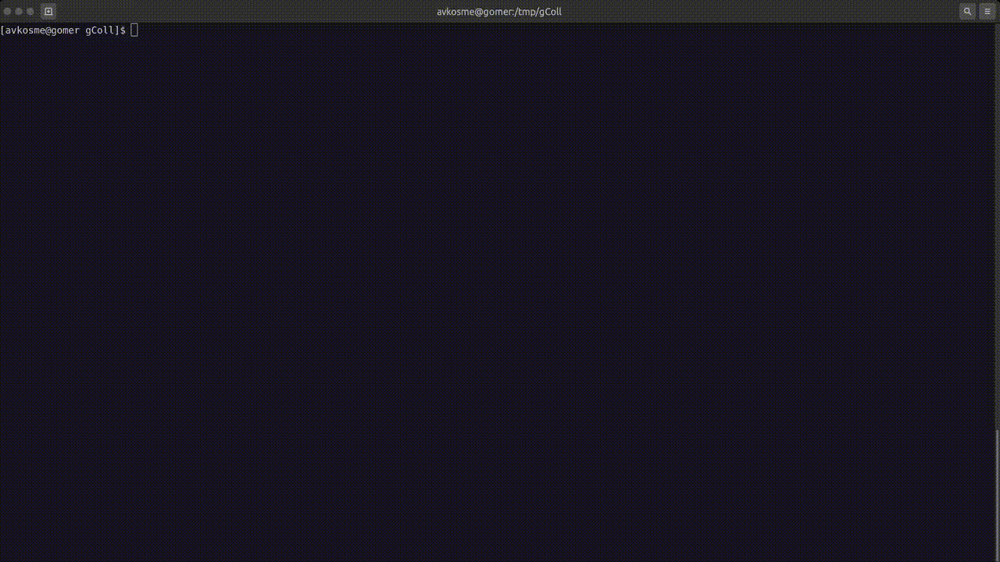

# Golang nvim development environment

Golang dev env with nvim, vim plugins, code navigator, tmux

## Docker Pull Command

```
$ docker pull avkosme/golang-dev
```

## Quick start

Create local volumes, run container in current directory:

```
$ docker volume create --driver local --name nvimdotfiles

$ docker volume create --driver local --name gobin

$ echo 'alias golang-dev="docker run -ti --rm -v nvimdotfiles:/root \
-v gobin:/go/bin -v `pwd`:/opt --workdir='/opt' ghcr.io/avkosme/golang-dev:latest sh"' >> ~/.bashrc

$ source ~/.bashrc

$ golang-dev
```

Inside the running container:

```
$ tmux -2

$ nvim
```


